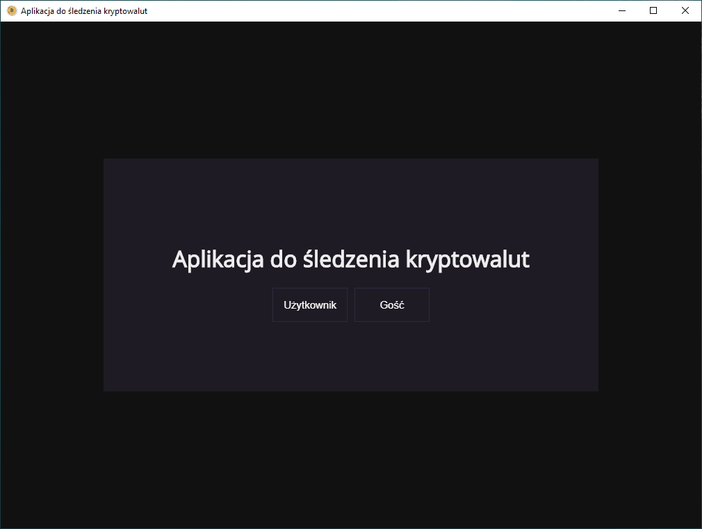

Aplikacja powstała we współpracy z moim serdecznym kolegą Mateuszem jako projekt zaliczeniowy na studia.

## Wymagania
Node.js oraz npm można pobrać z [nodejs.org](https://nodejs.org) 
Uruchomiony serwer (back-end) z [bitbucket.org](https://bitbucket.org/Mateusze/crypto-service/src/master/)

## Demo
Aplikacja została pisana pod Electrona, więc niektóre funkcje mogą nie działać poprawnie w wersji internetowej.

https://mj-cryptoapp.herokuapp.com/ (poczekaj, aż heroku wstanie)

## Podgląd

## Skrypty

W folderze z projektem możesz użyć:

### `npm start`

Uruchamianie aplikacji w wersji developerskiej. 

### `npm run build`

Budowanie aplikacji w wersji produkcyjnej. 

### `npm run react-build`

Budowanie aplikacji React. 

### `npm run electron-build`

Budowanie aplikacji Electron. 

**Informacja: musisz najpierw zbudować aplikację React!**
